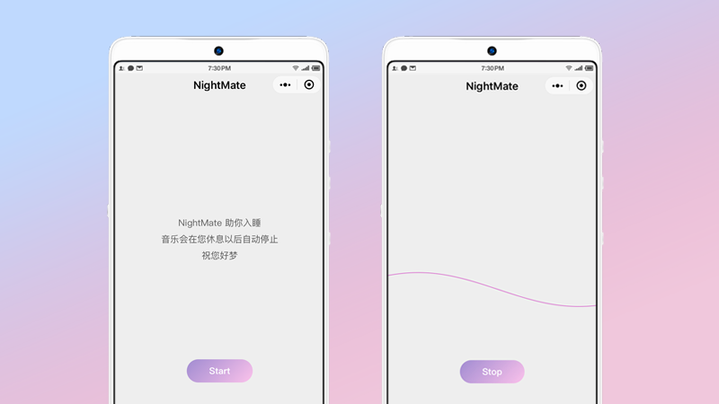

import nmQR from '../../assets/images/nmQR.png';

### 一个想法
凌晨2点钟，给所有 APP 都点了一遍后，还是一点睡意也没有，如无意外，我再一次失眠了。对于失眠，大多数是因为白天太闲造成的精力过剩，只要精力被消耗殆尽，就会乖乖入睡，百试百灵。然而也有一少部分人是因为胡思乱想造成的失眠，在脑海中数了一万只羊后，可能会因为数量太大而再数一遍。如果你正好是后一种，白噪音可能能救你一夜。

你说失眠也不是天天的事儿，不能为了一年才用一次的功能下载一 APP 吧？这不，小龙哥的微信小程序就是来解决这一类问题的。我在微信搜索中搜到了几个白噪音的小程序，还不错，只是这么多选项让本来只想快点入睡的我更加清醒，就不能简单点儿吗？

简单到只有一个开关，然后闭眼就好。

想法有了，那就试试呗。

### 开工

- 播放音乐
```HTML
<audio poster = "{{poster}}" name = "{{name}}" author = "{{author}}" src = "{{src}}" id = "myAudio" loop></audio>
```
- 控制
```Javascript
audioPlay: function () {
    this.audioCtx.play()
},
audioPause: function () {
    this.audioCtx.pause()
}
```
- 随机时间
```Javascript
var timer = parseInt(Math.random()* 2400000 + 1200000,10)
```

### Bug

按照上面的思路一番尝试，功能大致是好了，就是会遇到一点小问题，播放的时候会等着整个音频加载完毕后才可以播放。尤其我使用的音频又有20多兆，这个问题必须解决，才能上线。

说来也简单，只需将上面播放音频的API 换成 背景音频 API 就能解决这个问题

### 上线

至此，小程序就如想法一样，打开开关，睡觉吧。
原本想的名字也遵循简单的原则，可惜被使用了，最后又想了一个洋气点儿的，叫 NightMate 。
图标、名字等相关内容都填写好后，提交代码审核，等待通过后就算是大功告成了。



<div align="center">

</div>
