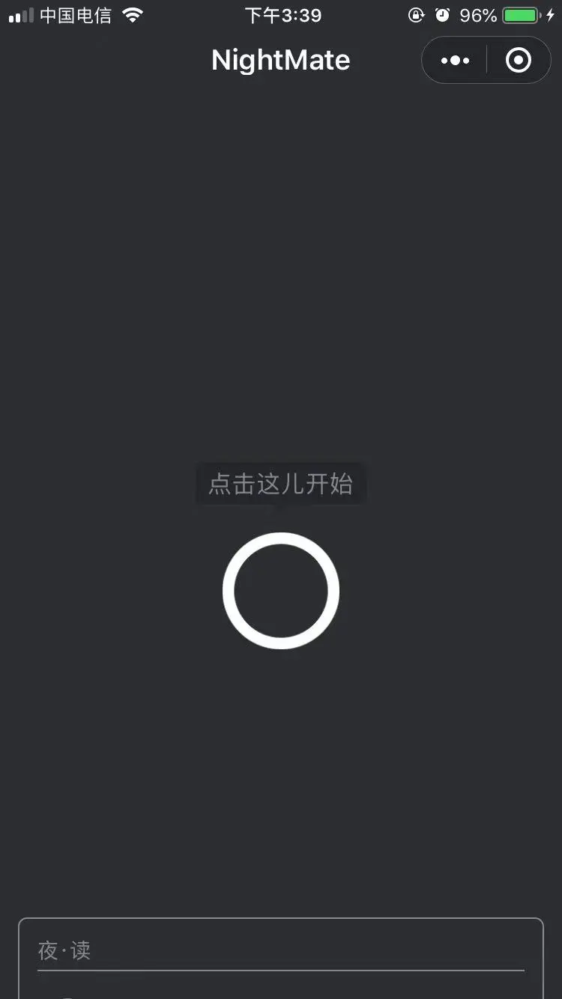

一个助眠类 APP 最需要的就是「克制」！

想象一下，当你在深夜两点，打开一个助眠类 APP 时，你想要什么？丰富的背景噪音？还是精细的时间控制？又或者是把失眠的人聚在一块儿，抱团取取暖？

随便打开一个助眠 APP，去看看他们是怎么思考失眠这件事情的。我相信，即使设计者本人失眠了，也一定会去用自己的 APP。谁会在半夜，划拉半天去选择这些呢？

于是，我就自己做了一个微信小程序：NightMate。

去掉所以的选项，就一个按钮，点了就开始，睡着就自动关闭。这是「克制」下的产物。

