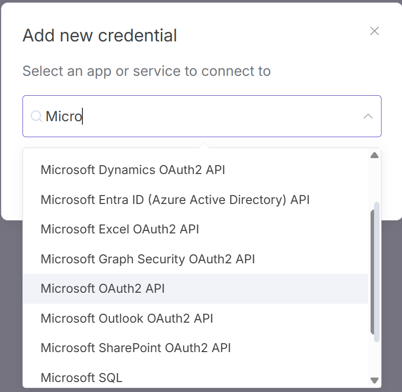
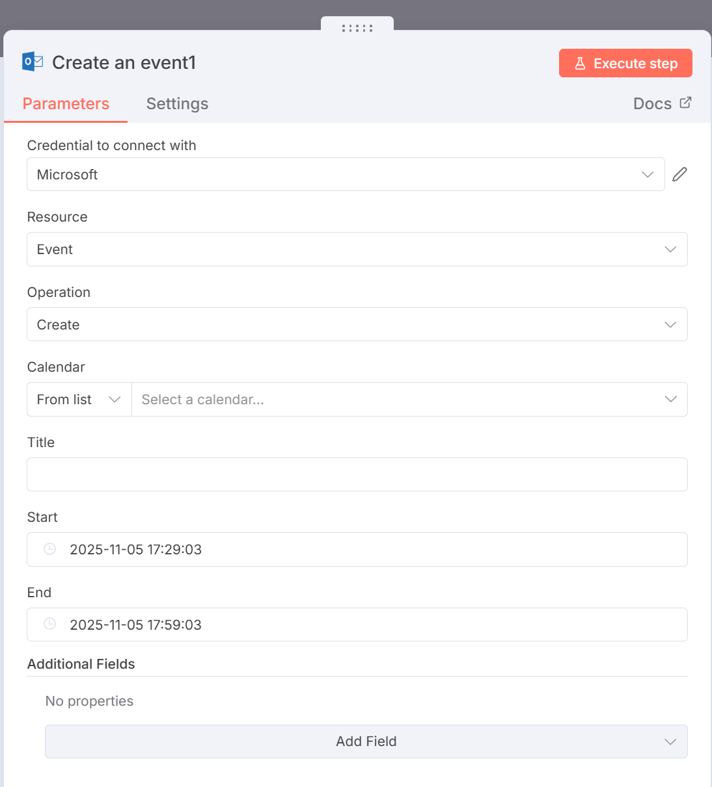
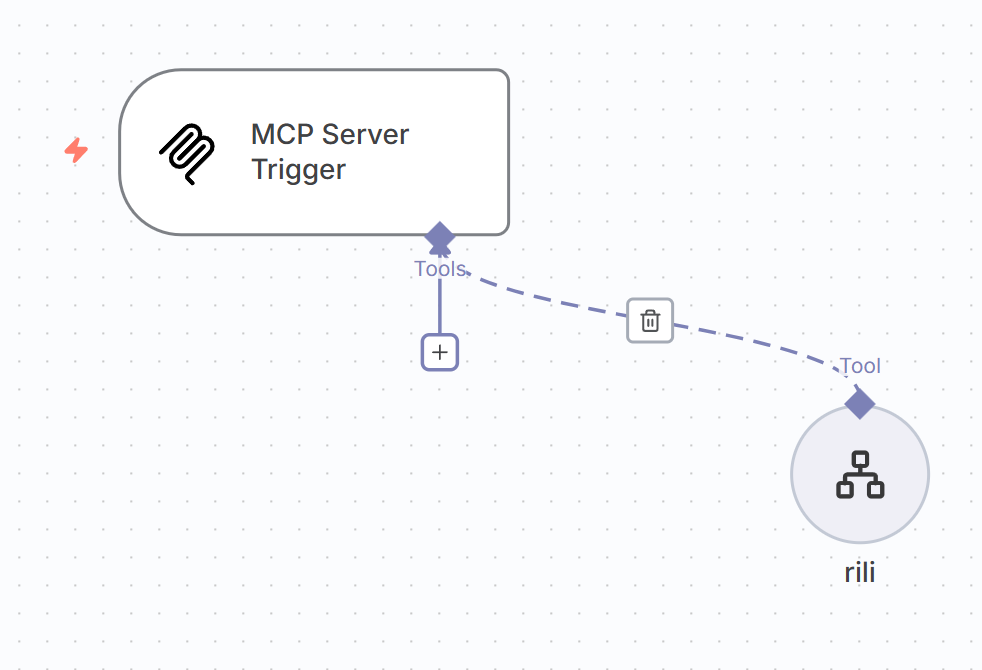
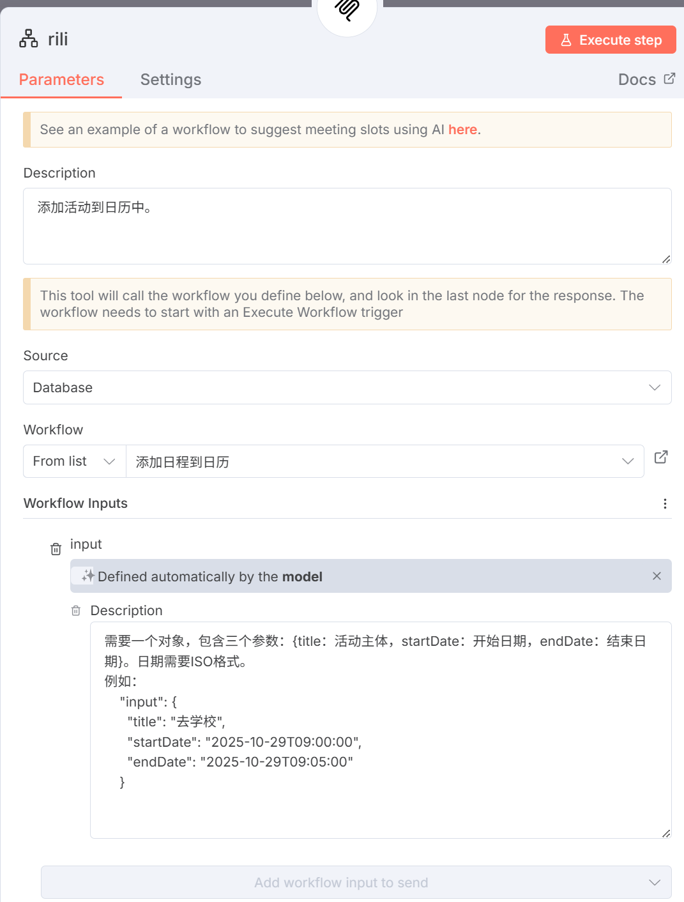
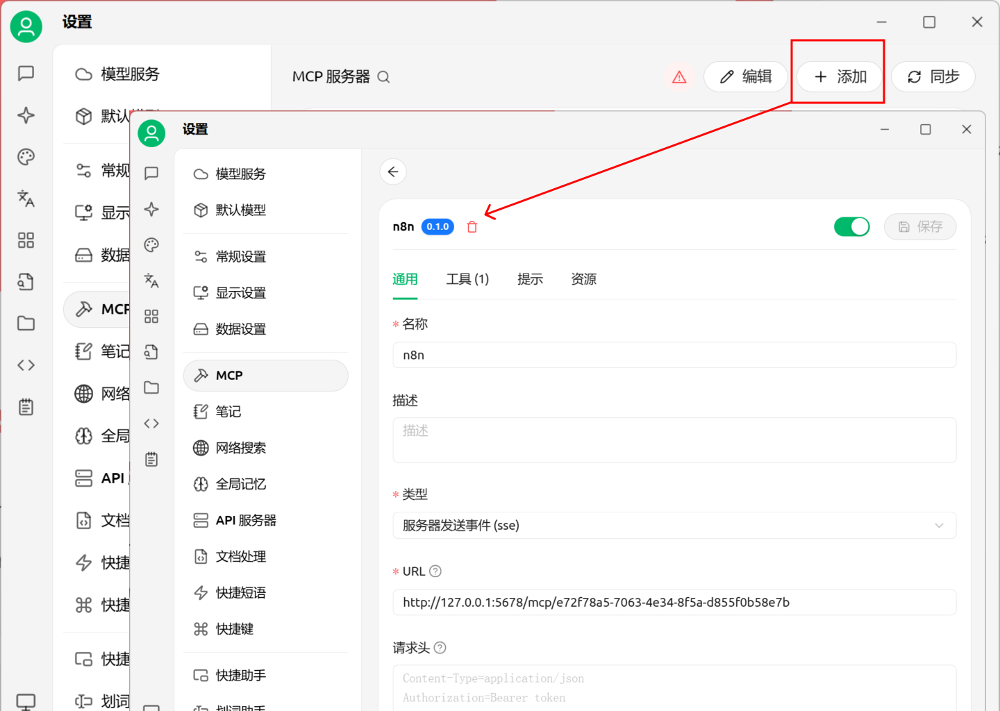
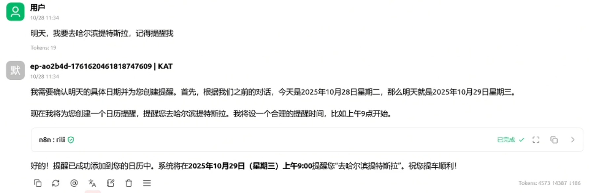
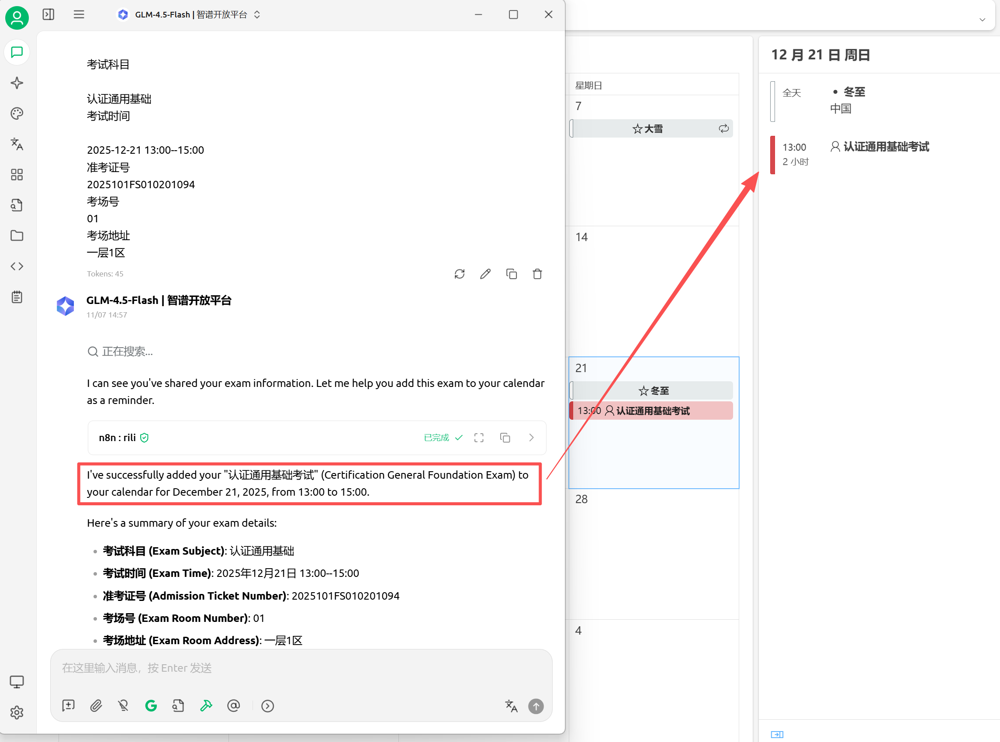

目前工作流平台三分天下：Coze、Dify、n8n。n8n 是集成第三方最多的平台，当然了大部分是国外的服务。Coze 对飞书支持最好，搭配飞书文档很顺手。Dify API 很好用，但是很慢很重。都说工作流是上个时代的产物，但是目前能实际做出成品且稳定的应用还得是工作流模式。本文分为两部分，一是 n8n 的部署，二是通过 n8n 创建一个 MCP Server，用来与 AI 配合使用。
# 部署 n8n
Docker 前先创建数据存储位置，然后拉取 n8n 镜像
```bash
docker volume create n_data
docker pull n8nio/n8n # 删掉docker.n8n.io，否则会提示错误
```

运行 Docker 可以配置很多信息，最重要的是时区，不配置的话看时间怪怪的。如果使用域名，需配置`N8N_HOST`,`N8N__EDITOR_BASE_URL`,`WEBHOOK_URL`，否则会出现一些地址错误问题
```bash
docker run -d --rm --name n8n -p 5678:5678 
-e GENERIC_TIMEZONE="Asia/Shanghai" 
-e TZ="Asia/Shanghai" 
-e VUE_APP_URL_BASE_API="https://example.com" 
-e N8N_HOST="https://example.com"
-e N8N_EDITOR_BASE_URL="https://example.com"
-e WEBHOOK_URL="https://example.com"
-e N8N_PROXY_HOPS=1 
-v n_data:/home/node/.n8n 
n8nio/n8n
```

最后是 Nginx，除了转发代理，还用到了 websocket，否则会出现无法保存的情况。
```nginx
    # proxy 
    proxy_set_header Host $host; 
    proxy_set_header X-Real-IP $remote_addr; 
    proxy_set_header X-Forwarded-For $proxy_add_x_forwarded_for; 
    proxy_set_header X-Forwarded-Proto $scheme; 

    # websocket 
    proxy_http_version 1.1;   
    proxy_set_header Upgrade $http_upgrade;   
    proxy_set_header Connection "upgrade";
```

# 一个 MCP 工具
首先我将创建添加日程的工作流来熟悉一下 n8n，让后将这个工作流注册为 MCP Server，方便添加到 AI 机器人中被调用，最后在 AI 工具中，通过自然语言自动调用我们刚刚创建的工作流。
1. 创建日程的工作流
	1. 这里的创建日程并不是直接在手机或者电脑中直接创建，而是通过邮箱里的日历来实现，这样在其它设备上绑定邮箱日历，就可以同步日程。n8n 中有众多日历节点，选择你常用的邮箱平台即可。

	2. 创建 Credential，这是连接第三方平台的 API Key，有了这个 Key 证明你有访问平台接口的能力，一般开发者账号才能有 API Key，所以连接第三方平台，得先注册平台的开发者账号。
   	   
	3. 在日历节点中选择对应的 Credential，找到创建日程节点。可以看到我们需要三个参数，分别是日程标题、开始时间、结束时间。到这第一步就完成了，我们填上相应的参数，运行一下，可以看到日历中已经添加上刚刚的日程。
   	  
2. MCP Server
	1. n8n 中有一个 MCP Server Trigger 节点，这个节点能启动一个 MCP 服务器，连接到服务器上的人就能读取我们创建的工作流，只要把创建的工作流添加到这个 Tools 下就行。描述一下怎么使用这个工具，方便大模型正确理解我们需要的参数。
   	   
   	  
3. 与大模型结合
	1. 找一个支持 MCP 的 AI 工具，把我们刚刚创建的 MCP 地址填进去。这里我用 Cherry Studio 工具演示。
   	   
	2. 我尝试复制一份日历信息，能正常调用工具。模糊点的信息就需要用更好的模型
   	   
   	   
好，经过这个简单的小案例，对工作流以及与 AI 大模型的结合使用有了一个基本认识。通过对一件事流程化，我们就可以形成工作流，从而一劳永逸的自动执行。通过与 AI 的结合，AI 识别意图，调用工具，从而进一步解放我们。从重复性的工作解放出来，去创造吧！


