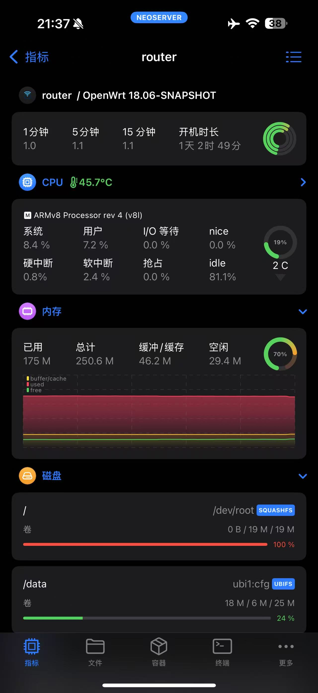

前段时间买了新路由，就想着玩玩 OpenWrt ，买回来也没折腾，这几天想起来了就折腾一下。
第一步就是解锁SSH，GitHub 上有工具[xmir-patcher](https://github.com/openwrt-xiaomi/xmir-patcher/)。按照提示操作就行了，运行 run.bat ，选 2 即可。

解锁SSH以后我们就可以搞点事情啦，先进系统搂一眼。

```bash
ssh root@router_ip 
```

提示：`no matching host key type found. Their offer: ssh-rsa`。在 ssh 命令后添加`-oHostKeyAlgorithms=+ssh-rsa` 就好了。

进入系统我们可以看一下基本信息：

```bash
cat /proc/meminfo # 查看内存信息
df -h # 查看磁盘空间
```

随后就是安装需要的软件，由于这个路由器配置太低，能安装的软件有限，要不然还可以配置 Home Assistant，直接将米家接入苹果生态。还有小米路由器本身用的就是 OpenWrt 且官方的固件也够用，我也就没有再刷机，感觉没有必要。就这么玩吧，也够我折腾。

