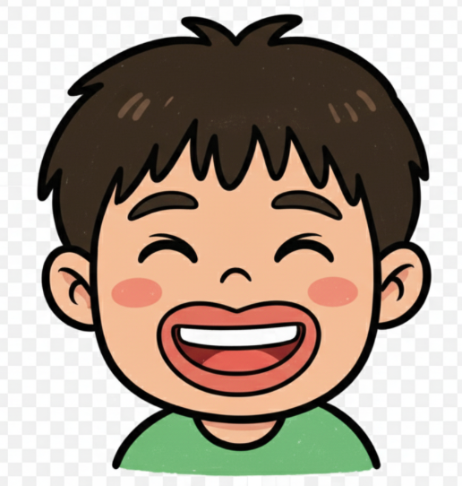
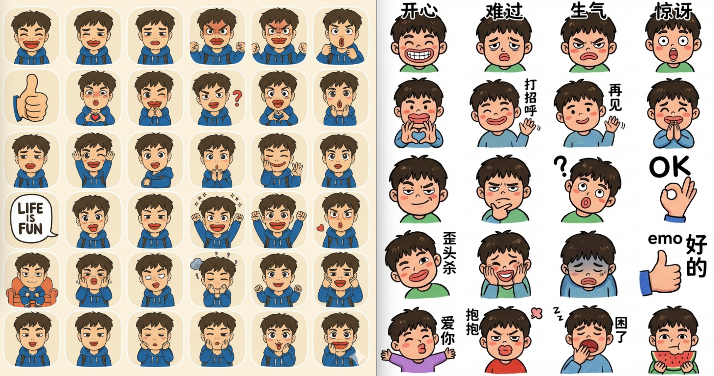
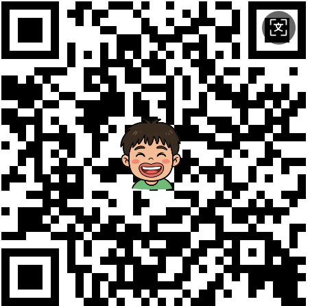
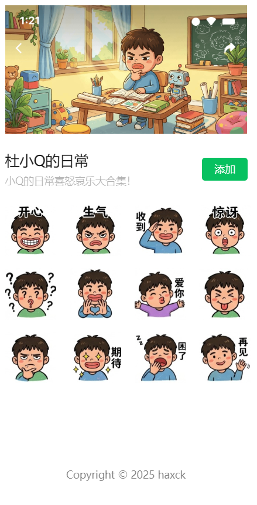

这几天 Nano Banana Pro 新发布，效果好到飞起。什么物件分拆解释，人像美颜，就连上次 3D 小人都有了质的改观。刷着刷着看到了一条做表情的 Promt，试用了一下，瞬间想到了几年前的做套表情的念头，我觉得这个想法可能马上要实现了。

表情最核心的就是主角，人物也好，动物也好，要可可爱爱，才有让人经常使用的欲望。还有准确传递情绪，喜极而泣，撒娇打滚，你就可劲琢磨吧。主角我选用了之前用 ChatGPT 生成的 Q 版人物，但还是要做一些小改动，强化个人特色，我选用了厚嘴唇，浓眉毛，这可能是我最明显的特征。

接着就可以使用魔法咒语来生成表情了，Promt 来自 X 上[@Gorden_Sun](https://x.com/Gorden_Sun)。在此基础上加上表情的一些描述，如开心（露出牙齿）、生气（头顶上冒气）的词汇，能更好的把控表情细节。

>为我生成图中角色的绘制 Q 版的，LINE 风格的半身像表情包，注意头饰要正确  
彩色手绘风格，使用 4x6 布局，涵盖各种各样的常用聊天语句，或是一些有关的娱乐 meme  
其他需求：不要原图复制。所有标注为手写简体中文。  
生成的图片需为 4K 分辨率 16:9

有了这么一张可用的图之后，只需要裁切成独立的表情就可以了。我使用的是 https://blockx-bay.vercel.app/ 这个工具。只需要在工具中填写对应的行数与列数即可。

打开微信表情开发平台（https://sticker.weixin.qq.com/ ）扫码直接登录，开始提交作品。提交过程中除了表情外，还需要横幅、封面图以及图标，如果开启赞赏还需要赞赏引导图和赞赏致谢图。这些图也用 Nano Banana Pro 来生成，需要注意的是背景边缘不要用白色，我就是因为这个，审核没通过。

封面图 Promt
> 表情人物单独生成一张图片，透明背景，图片为 240 * 240 像素，高画质。

横幅 Promt
>将上面的表情人物单独生成一张图片，图片为 750 * 400 像素，高画质。
图片中避免出现任何文字信息。  
图片色调要活泼明朗，与微信底色有较大的区分，避免使用白色背景。  
内容须与表情有关，画面丰富，人物只能有一个或两个，有故事性。  
图中元素不能因被拉伸或压扁等原因导致变形。  
避免使用透明背景。

赞赏 Promt
>使用人物形象，鞠躬感谢，图片为 750 * 750 像素，高画质。

在 AI 的帮助下，也算是完成了之前的一个小想法。这件事之后我想到两件事：
- 要把自己的想法记录下来，万一哪天就能轻松实现呢
- 如果有一天，AI 替代了人类工作，那么人类还可以干什么？

最后在你看到这篇文章时，可能我的表情包已经上架了，欢迎你体验试用。

