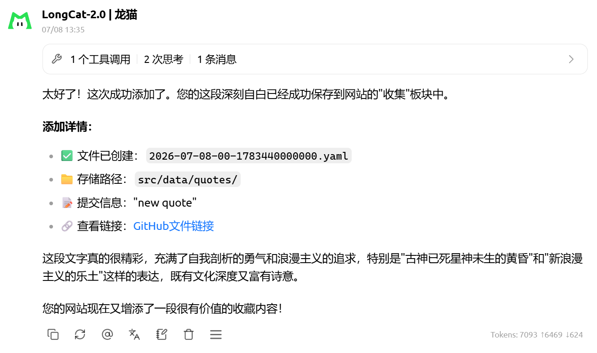
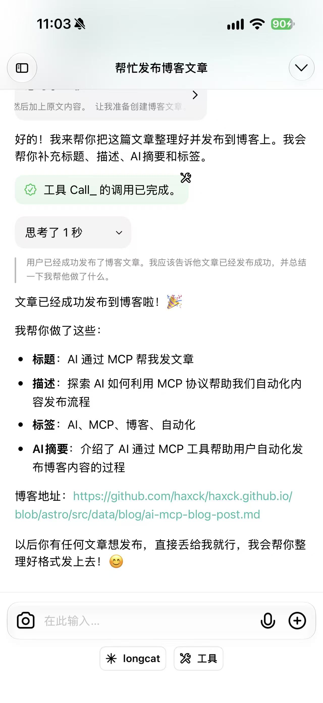

我一般习惯在 Obsidian 中写东西，包括博客也是，但这就导致发博客会非常繁琐。文章先通过插件到 Dify 中获取文章标题，AI 总结等头信息，然后再插到博客文件夹中，提交 Github 才能发布。繁琐，但没好办法。

直到最近，突然想到可以通过 MCP 来发文章。把文章交给 AI，根据内容生成 slug、tags、summary 等内容，然后把文章 Markdown 放到仓库就会自动打包、部署、上线。

正准备手写 MCP Server 又想到 N8N 也有 MCP Server 能力，就先用 N8N 搭着试试看，试用下来效果还不错。
![[Pasted image 20260708163650.png|720]]

在手机上配置好 MCP 同样能发博客。

之前一直在想 Skill 与 MCP 之间的区别，Skill 能将 Prompt、使用方法与脚本打包在一起，按照一定的情况调用脚本。后来工具官方纷纷推出自家 CLI 以方便调用各种服务，把服务封装成标准化命令，以改善过去刀耕火种的野蛮脚本时代。但这始终是在本地，脚本也好，CLI 始终依赖 Shell 环境，一旦脱离这个环境，就无法运行。MCP 的优点正是部署在服务端，运行服务端，不依赖本地环境，像 API 一样方便使用。

所以厂商们，别只关注 CLI，开放 MCP 吧。